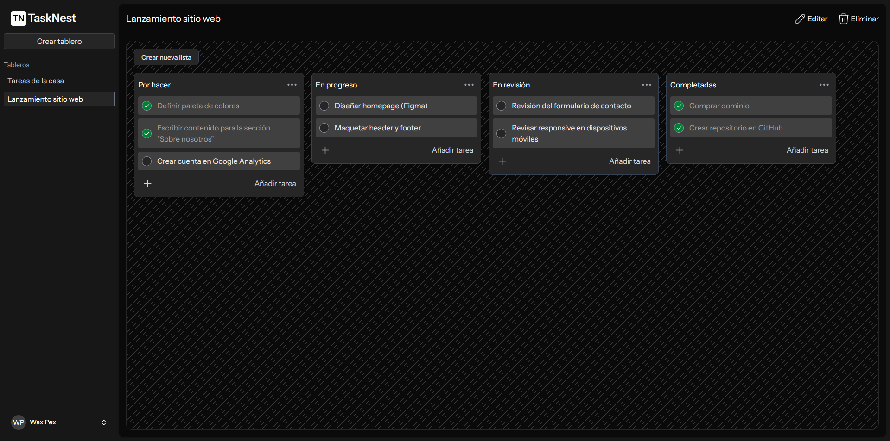

# TaskNest



- [Español](#Español)

- [English](#english)

## Español

**TaskNest** es una aplicación web de gestión de tareas estilo Trello, que permite crear tableros, listas y tareas con una interfaz moderna y responsiva. Ideal para organizar tu trabajo o proyectos personales.

## 🚀 Funcionalidades

- ✅ Registro de usuarios con verificación por correo electrónico
- 🔐 Autenticación segura
- 📌 Crear múltiples tableros
- 📝 Crear listas dentro de los tableros y agregar tareas
- ✔️ Marcar tareas como completadas
- 🧪 Modo local sin necesidad de registro (usa localStorage)
- 🎨 Interfaz responsiva y moderna
- 🌙 Soporte para modo oscuro

## 🛠️ Tecnologías utilizadas

- **Laravel** (backend)
- **Inertia.js** (puente entre Laravel y React)
- **React** (frontend)
- **Tailwind CSS** (estilos)
- **SweetAlert2** (alertas e inputs modales)

## 📦 Instalación local

1. Clona el repositorio

```bash
    git clone https://github.com/Pex-Dev/TaskNest.git
```

2. Instalar dependencias

```bash
    composer install
    npm install
```

3. Crea tu archivo .env

```bash
    cp .env.example .env
    php artisan key:generate
```

4. Configura tu base de datos y APP_URL en .env
5. Ejecuta las migraciones

```bash
    php artisan migrate
```

6. Levanta el servidor

```bash
    composer run dev
```

## English

TaskNest is a Trello-style task management web app that lets you create boards, lists, and tasks with a modern, responsive interface. Perfect for organizing your work or personal projects.

## 🚀 Features

- ✅ User registration with email verification
- 🔐 Secure authentication
- 📌 Create multiple boards
- 📝 Create lists within boards and add tasks
- ✔️ Mark tasks as completed
- 🧪 Local mode without registration (uses localStorage)
- 🎨 Responsive and modern interface
- 🌙 Dark mode support

## 🛠️ Tech Stack

- Laravel (backend)
- Inertia.js (bridge between Laravel and React)
- React (frontend)
- Tailwind CSS (styling)
- SweetAlert2 (modal alerts and inputs)

📦 Local Installation

1. Clone the repository

```bash
    git clone https://github.com/Pex-Dev/TaskNest.git
```

2. Install dependencies

```bash
    composer install
    npm install
```

3. Create your .env file

```bash
    cp .env.example .env
    php artisan key:generate
```

4. Set up your database and APP_URL in the .env file
5. Run the migrations

```bash
    php artisan migrate
```

6. Start the development server

```bash
    composer run dev
```
